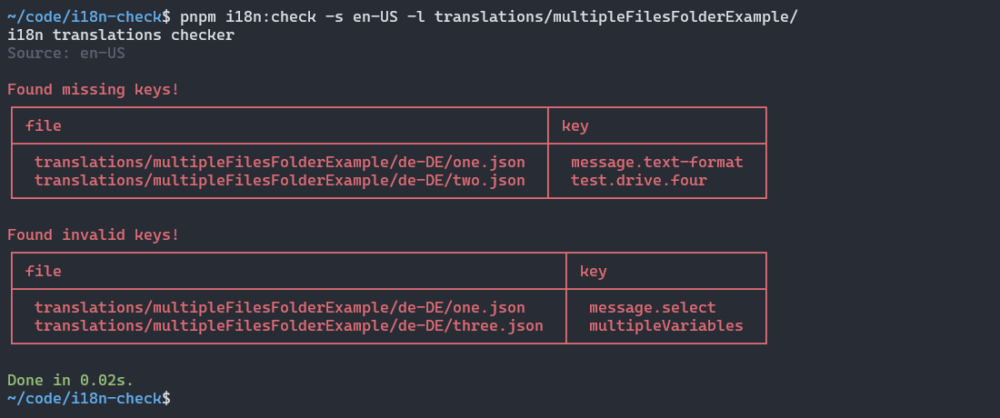
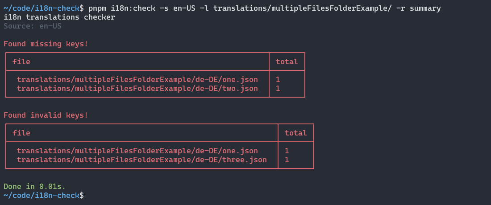
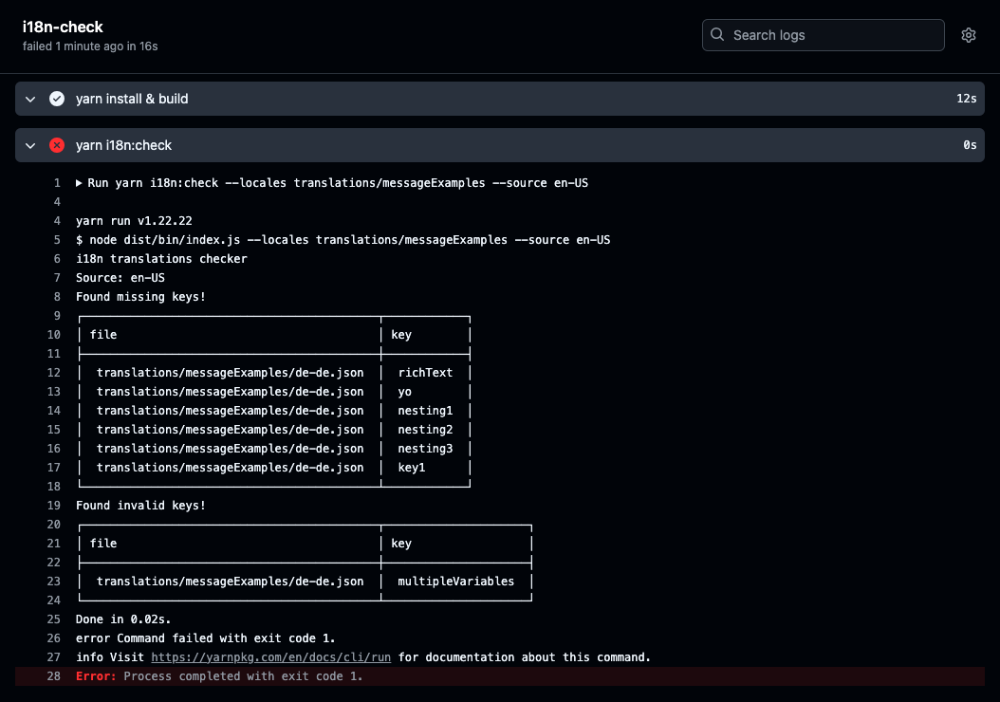

# Lingual i18n-check

**i18n-check** validates your [ICU](https://github.com/unicode-org/icu) and [i18next](https://www.i18next.com/) translation files and checks for missing and broken translations.
It compares the defined source language with all target translation files and finds inconsistencies between source and target files.
You can run these checks as a pre-commit hook or on the CI depending on your use-case and setup.





## Table of Contents

- [Installation](#installation)
- [General Usage](#general-usage)
- [CLI Options](#options)
- [Examples](#examples)
  - [Single folder](#single-folder)
  - [Folder per locale](#folder-per-locale)
  - [Folder per locale with multiple files](#folder-per-locale-with-multiple-files)
- [Github Action](#as-github-action)
- [API](#api)
- [Development](#development)
- [Links](#links)

## Installation

Using **yarn**:

```bash
yarn add --dev @lingual/i18n-check
```

Using **npm**:

```bash
npm install --save-dev @lingual/i18n-check
```

Using **pnpm**:

```bash
pnpm add --save-dev @lingual/i18n-check
```

After the installation, i18n-check can either be accessed via defining a command in the `package.json` file or directly in the CLI.

Update your `package.json` and add a new command:

```bash
"scripts": {
    // ...other commands,
    "i18n:check": "i18n-check"
}
```

Now you can run the `i18n:check` command directly from the command-line, i.e. `yarn i18n:check`.

Alternatively you can also access the library directly:

```bash
node_modules/.bin/i18n-check
```

## General Usage

For i18n-check to work you need to provide it at a minimum the source locale (`--source, -s`) for the primary language and the path to the locale translation files (`--locales, -l`). Currently supported file formats are JSON and YAML.

Example:

```bash
yarn i18n:check -s en-US --locales translations/
```

Instead of a single source file you can also pass a directory:

```bash
yarn i18n:check -s en-US --locales translations/
```

See the [examples](#examples) for more details.

## Options

### --locales, -l

With the `-l` or `--locales` option you define which folder or multiple folders you want to run the i18n checks against. It is a **required** option. i18n-check will try to find all target locale files and compare these files against the defined source file(s).
Check the [example](#examples) to see how different locale translation files are organised and how they can be addressed.

```bash
yarn i18n:check --locales translations/messageExamples -s en-US
```

### --source, -s

With the `-s` or `--source` option you define the source locale to compare all target files against. It is a **required** option. i18n-check will try to find all target locale files and compare these files against the applicable source file(s).
Check the [examples](#examples) to see how different locale translation files are organised and how they can be addressed.

```bash
yarn i18n:check --locales translations/messageExamples -s en-US
```

### --format, -f

By default i18n-check will validate against any [ICU](https://github.com/unicode-org/icu) compliant translations.
Additionally the `i18next` format is supported and can be set via the `-f` or `--format` option.

There are i18n libraries that have their own specific format, which might not be based on ICU and therefore can not be validated against currently. On a side-note: there might be future support for more specific formats.

Hint: If you want to use the `--unused` flag, you should provide `react-intl` or `i18-next` as the format. Also see the [`unused` section](#--unused) for more details.

```bash
yarn i18n:check --locales translations/i18NextMessageExamples -s en-US -f i18next
```

### --only, -o

By default i18n-check will perform a validation against any **missing** and/or **invalid** keys, additionally **unused** and **undefined** checks if the `--unused` option is set. There are situations where only a specific check should run. By using the `-o` or `--only` option you can specify a specific check to run.

The available options are:

- `missingKeys`: will check against any missing keys in the target files.
- `invalidKeys`: will check for invalid keys, where the target translations has a different type then the one defined in the source file.
- `unused`: will check for any locale keys that do not exist in the codebase.
- `undefined`: will check for any keys that exist in the codebase but not in the source locale files.

Check for missing keys only:

```bash
yarn i18n:check --locales translations/messageExamples -s en-US -o missingKeys
```

Check for invalid keys only:

```bash
yarn i18n:check --locales translations/messageExamples -s en-US -o invalidKeys
```

Check for unused key only:

```bash
yarn i18n:check --locales translations/messageExamples -s en-US -o unused
```

Check for undefined keys only:

```bash
yarn i18n:check --locales translations/messageExamples -s en-US -o undefined
```

Check for missing and invalid keys (which is the default):

```bash
yarn i18n:check --locales translations/messageExamples -s en-US -o missingKeys invalidKeys
```

Check for unused and undefined keys only:

```bash
yarn i18n:check --locales translations/messageExamples -s en-US -o unused undefined
```

### --unused, -u

This feature is currently only supported for `react-intl` and `i18next` as well as `next-intl` (experimental at the moment) based React applications and is useful when you need to know which keys exist in your translation files but not in your codebase. Additionally an inverse check is run to find any keys that exist in the codebase but not in the translation files.

Via the `-u` or `--unused` option you provide a source path to the code, which will be parsed to find all unused as well as undefined keys in the primary target language.

It is important to note that you must also provide the `-f` or `--format` option with `react-intl`, `i18next` or `next-intl` as value. See the [`format` section](#--format) for more information.

```bash
yarn i18n:check --locales translations/messageExamples -s en-US -u client/ -f react-intl
```

or

```bash
yarn i18n:check --locales translations/messageExamples -s en-US -u client/ -f i18next
```

or

```bash
yarn i18n:check --locales translations/messageExamples -s en-US -u client/ -f next-intl
```

### --reporter, -r

The standard reporting prints out all the missing or invalid keys.
Using the `-r` or `--reporter` option enables to override the standard error reporting. Passing the `summary` option will print a summary of the missing or invalid keys.

```bash
yarn i18n:check --locales translations/messageExamples -s en-US -r summary
```

### --exclude, -e

There are situations where we want to exclude a single or multiple files or a single folder or a group of folders. A typical scenario would be that some keys are missing in a specific folder, as they are being work in progress for example. To exclude this or these files/folders you can use the `-e` or `--exclude` option. It expects one or more files and/or folders.

To exclude a single file:

```bash
yarn i18n:check --locales translations/messageExamples -s en-US -e translations/messageExamples/fr-fr.json
```

To exclude multiple files provide all files:

```bash
yarn i18n:check --locales translations/messageExamples -s en-US -e translations/messageExamples/fr-fr.json translations/messageExamples/de-at.json
```

To exclude a single folder:

```bash
yarn i18n:check --locales translations/folderExamples -s en-US -e translations/folderExamples/fr/*
```

Alternatively you can exclude multiple folders by providing the folders to be excluded:

```bash
yarn i18n:check --locales translations/folderExamples -s en-US -e translations/folderExamples/fr/* translations/folderExample/it/*
```

The `--exclude` option also accepts a mix of files and folders, which follows the same pattern as above, i.e.
`-e translations/folderExamples/fr/* translations/messageExamples/it.json`

### --ignore, -i

There can be situations where we only want to translate a feature for a specific region and therefore need to ignore any missing key checks against non supported locales. Another scenario is that we know of the missing keys and want to be able to skip these missing keys when running checks. For these aforementioned scenarios, by using the `--ignore` or `-i` option you can specify which keys to ignore, additionally also being able to define ignoring all keys inside a defined path, i.e. `some.keys.path.*`.

To ignore regular keys:

```bash
yarn i18n:check --locales translations/folderExamples -s en-US -i some.key.to.ignore other.key.to.ignore
```

To ignore all keys within a provided path:

```bash
yarn i18n:check --locales translations/folderExamples -s en-US -i "some.path.to.keys.*"
```

A mix of regular keys and paths:

```bash
yarn i18n:check --locales translations/folderExamples -s en-US -i "some.path.to.keys.*" some.key.to.ignore other.key.to.ignore
```

### --parser-component-functions

When using the `--unused` option, there will be situations where the i18next-parser will not be able to find components that wrap a `Trans` component.The component names for i18next-parser to match should be provided via the `--parser-component-functions` option. This option should onlybe used to define additional names for matching, a by default `Trans` will always be matched.

```bash
yarn i18n:check --locales translations/i18NextMessageExamples -s en-US -f i18next
-u src --parser-component-functions WrappedTransComponent
```

```bash
yarn i18n:check --locales translations/i18NextMessageExamples -s en-US -f i18next
-u src --parser-component-functions WrappedTransComponent AnotherWrappedTransComponent
```

## Examples

i18n-check is able to load and validate against different locale folder structures. Depending on how the locale files are organized, there are different configuration options.

### Single folder

If all the locales are organized in a **single folder**:

```
locales/
  en-en.json
  de-de.json
```

Use the `-l` or `--locales` option to define the directory that should be checked for target files. With the `s` or `source` option you can specify the base/reference file to compare the target files against.

```bash
yarn i18n:check --locales locales -s locales/en-us.json
```

### Folder per locale

If the locales are **organised as folders** containing a single JSON/YAML file:

```
locales/
  en-US/
    index.json
  de-DE/
    index.json
```

Define the `locales` folder as the directory to look for target files.

```bash
yarn i18n:check --locales locales -s en-US
```

### Folder per locale with multiple files

If the locales are **organised as folders** containing multiple JSON/YAML files:

```
locales/
  en-US/
    one.json
    two.json
    three.json
  de-DE/
    one.json
    two.json
    three.json
```

Define the `locales` folder as the directory to look for target files and pass `locales/en-US/` as the `source` option. i18n-check will try to collect all the files in the provided source directory and compare each one against the corresponding files in the target locales.

```bash
yarn i18n:check --locales locales -s en-US
```

#### Multiple folders containing locales

If the locales are **organised as folders** containing multiple JSON/YAML files:

```
- spaceOne
  - locales/
    - en-US/
      - one.json
      - two.json
      - three.json
    - de-DE/
      - one.json
      - two.json
      - three.json
- spaceTwo
  - locales/
    - en-US/
      - one.json
      - two.json
      - three.json
    - de-DE/
      - one.json
      - two.json
      - three.json
```

Define the `locales` folder as the directory to look for target files and pass `en-US` as the `source` option. i18n-check will try to collect all the files in the provided source directory and compare each one against the corresponding files in the target locales.

```bash
yarn i18n:check -l spaceOne spaceTwo -s en-US
```

## As Github Action

We currently do not offer an explicit **Github Action** you can use out of the box, but if you have i18n-check already installed, you can define your own **YAML** file. The following example can be seen as a starting point that you can adapt to your current setup:

```yml
name: i18n Check
on:
  pull_request:
    branches:
      - main
  push:
    branches:
      - main

jobs:
  i18n-check:
    runs-on: ubuntu-latest

    steps:
      - uses: actions/checkout@master

      - name: yarn install & build
        run: |
          yarn install
          yarn build

      - name: yarn i18n-check
        run: |
          yarn i18n-check --locales translations/messageExamples --source en-US
```

The above workflow will return any missing or invalid keys and the action would fail if missing/invalid keys are found:



## API

Aside from using the CLI, i18n-check also exposes a set of check functions that can be accessed programmatically.
Start by importing i18n-check:

```ts
import * as i18nCheck from '@lingual/i18n-check';
```

### `i18nCheck.checkTranslations(source, targets [, options])`

`checkTranslations` expects the base and comparison or target files and returns an object containing the missing and invalid keys. The optional `options` objects can be provided as a third argument to define the format style via the `format` property, this is useful if you want to validate `i18next` specific translations.

```ts
import { checkTranslations } from '@lingual/i18n-check';

const options = {
  format: 'i18next',
};

const { invalidKeys, missingKeys } = checkTranslations(
  source,
  targets,
  options
);
```

Additionally the `options` object enables to also define which checks should run via the `checks` property, f.e. if you only want to check for missing or invalid keys only.

```ts
import { checkTranslations } from '@lingual/i18n-check';

const options = {
  format: 'icu',
  checks: ['invalidKeys'],
};

const { invalidKeys } = checkTranslations(source, targets, options);
```

Calling `checkTranslation` will return the following shape:

```ts
export type CheckResult = Record<string, string[]>;

type Result = {
  missingKeys: CheckResult | undefined;
  invalidKeys: CheckResult | undefined;
};
```

The result for `missingKeys` as well as `invalidKeys` is an object containing the provided locales and their corresponding affected keys as an array

```ts
{
  missingKeys:
    {
        "de-de": ["missing_example_key", "some_other_key"],
        "fr-fr": [],
    }
};
```

### `i18nCheck.checkMissingTranslations(source, targets)`

`checkMissingTranslations` checks for any missing keys in the target files. All files are compared against the source file.

```ts
import { checkMissingTranslations } from '@lingual/i18n-check';

const result = checkMissingTranslations(source, targets);

// {
//  "de-de": ["missing_translation_key", "some_other_missing_translation_key"],
//  "fr-fr": [],
// };
```

The result is an object containing the provided locales and their corresponding missing keys as an array.

### `i18nCheck.checkInvalidTranslations(source, targets [, options])`

`checkInvalidTranslations` checks if there are any invalid keys in the target files. All files are compared against the source file.

```ts
import { checkInvalidTranslations } from '@lingual/i18n-check';

const options = {
  format: 'i18next',
};

const result = checkInvalidTranslations(source, targets, options);

// {
//  "de-de": ["invalid_translation_key", "some_other_invalid_translation_key"],
//  "fr-fr": [],
// };
```

The result is an object containing the provided locales and their corresponding invalid keys as an array.

## Development

If you want to checkout and run the code, you need to run the `build` command first.

Run `pnpm run build` and then depending on the scenario one of the following commands.

Basic icu translation example:

```bash
node dist/bin/index.js --locales translations/messageExamples -s en-US
```

Flatted translation keys example:

```bash
node dist/bin/index.js --locales translations/flattenExamples -s en-US
```

i18next translation example:

```bash
node dist/bin/index.js --locales translations/i18NextMessageExamples -s en-US -f i18next
```

Single file translation example:

```bash
node dist/bin/index.js --locales translations/folderExample -s en-US
```

Multiple files per folder translation example:

```bash
node dist/bin/index.js --locales translations/multipleFilesFolderExample/ -s en-US
```

Multiple folders containing locales translation example:

```bash
node dist/bin/index.js --locales translations/folderExample,translations/messageExamples -s en-US
```

### Tests

To run the tests use one of the following commands:

```bash
pnpm test
```

## Links

- [Introducing i18n-check](https://lingual.dev/blog/introducing-i18n-check/)
- [Twitter](https://twitter.com/lingualdev)
