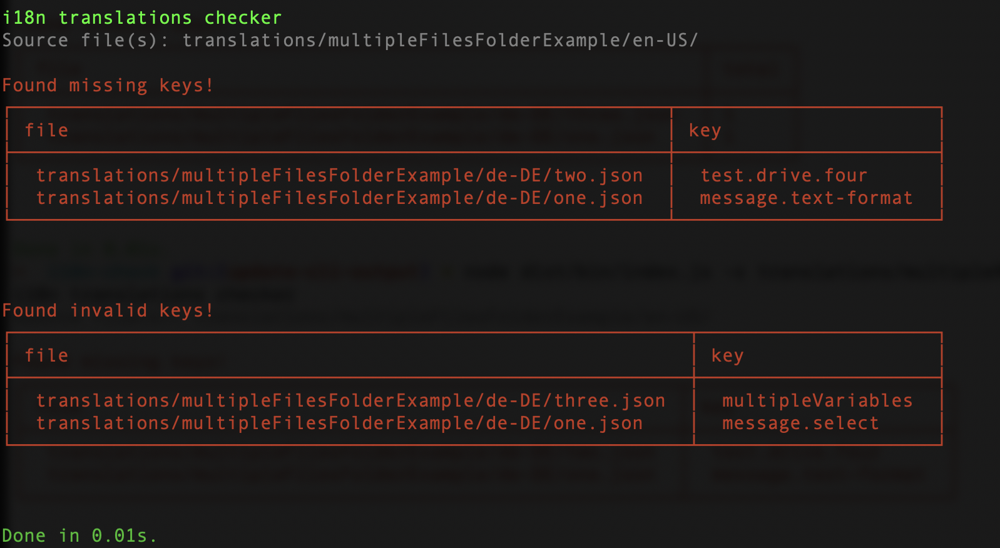
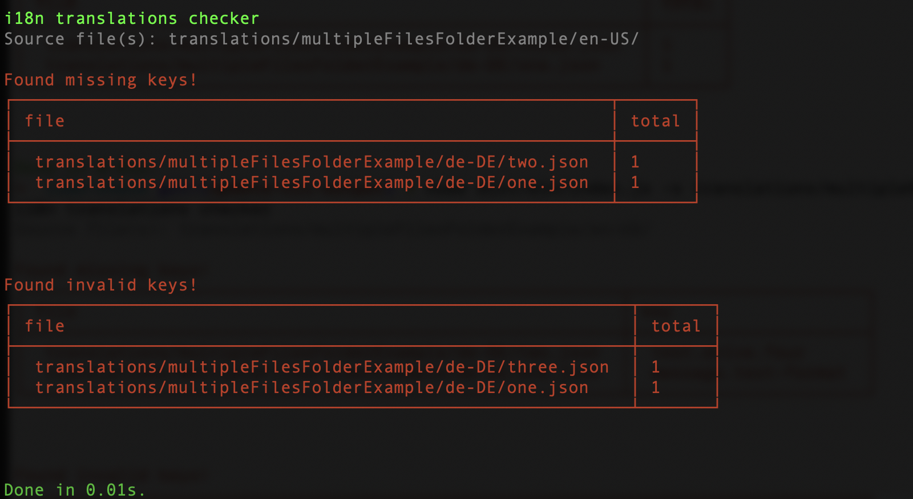

# Lingual i18n-check

**i18n-check** will help with validating your translation files, including
checking for missing and/or invalid/broken translations.
It will compare the defined source language with all target translation files and try to find inconsistencies between source and target files.
You can run these checks as a pre-commit hook or on the CI depending on your use-case and setup.





## Installation and Usage

Using **yarn**:

```bash
yarn add --dev @lingual/i18n-check
```

Using **npm**:

```bash
npm install --save-dev @lingual/i18n-check
```

Using **pnpm**:

```bash
pnpm add --save-dev @lingual/i18n-check
```

After the installation, `i18n-check` can either be accessed via defining a command in the `package.json` file or directly in the CLI.

Update the your `package.json` and add a new command:

```bash
"scripts": {
    // ...other commands,
    "i18n:check": "i18n-check"
}
```

Now you can run the `i18n:check` command directly from the command-line, i.e. `yarn i18n:check`.

Alternatively you can also access the library directly:

```bash
node_modules/.bin/i18n-check
```

## Options

### --target

With the `-t` or `--target` option you define which folder or multiple folders you want to run the i18n checks against. It is a **required** option. `i18n-check` will try to find all target locale files and compare these files against the defined source file(s).
Check the [example](#examples) to see how different locale translation files are organised and how they can be addressed.

```bash
yarn i18n:check -t translations/messageExamples -s translations/messageExamples/en-us.json
```

### --source

With the `-s` or `--source` option you define which file(s) or folder(s) you want to use as the source to compare all target files against. It is a **required** option. `i18n-check` will try to find all target locale files and compare these files against the defined source file(s).
Check the [example](#examples) to see how different locale translation files are organised and how they can be addressed.

```bash
yarn i18n:check -t translations/messageExamples -s translations/messageExamples/en-us.json
```

### --format

By default `i18n-check` will validate against any [`icu`](https://github.com/unicode-org/icu) compliant translations.
Additionally the `i18next` format is supported and can be set via the `-f` or `--format` option.

There are i18n libraries that have their own specific format, which might not be based on `icu` and therefore can not be validated against currently. On a side-note: there might be future support for more specific formats.

Hint: If you want to use the `--unused` flag, you should provide `react-intl` as the format. Also see the [`unused` section](#--unused) for more details.

```bash
yarn i18n:check -t translations/i18NextMessageExamples -s translations/i18NextMessageExamples/en-us.json -f i18next
```

### --check

By default the `i18n-check` will perform a validation against any **missing** and/or **invalid** keys. There are situations where only a specific check should run. By using the `-c` or `--check` option you can specify a specific check to run.

The available options are `missingKeys`, which will check against any missing keys in the target files and `invalidKeys` will check for invalid keys, where the target translations has a different type then the one defined in the source file.

Check for missing keys:

```bash
yarn i18n:check -t translations/messageExamples -s translations/messageExamples/en-us.json -c missingKeys
```

Check for invalid keys:

```bash
yarn i18n:check -t translations/messageExamples -s translations/messageExamples/en-us.json -c invalidKeys
```

Check for missing an invalid keys (which is the default):

```bash
yarn i18n:check -t translations/messageExamples -s translations/messageExamples/en-us.json -c missingKeys,invalidKeys
```

### --unused

This feature is currently only supported for `react-intl` and is useful if you need to know which keys exist in your translation files but not in your codebase. Via the `-u` or `--unused` option you provide a source path to the code, which will be parsed to find all unused keys in the primay target language.

It is important to note that you must also provide the `-f` or `--format` option with `react-intl` as value. See the [`type` section](#--format) for more information.

```bash
yarn i18n:check -t translations/messageExamples -s translations/messageExamples/en-us.json -u client/ -f react-intl
```

### --reporter

The standard reporting prints out all the missing or invalid keys.
Using the `-r` or `--reporter` option enables to override the standard error reporting. Passing the `summary` option will print a summary of the missing or invalid keys.

```bash
yarn i18n:check -t translations/messageExamples -s translations/messageExamples/en-us.json -r summary
```

### --exclude

There are situations where we want to exclude a single or multiple files or a single folder or a group of folders. A typical scenario would be that some keys are missing in a specific folder, as they are being work in progress for example. To exclude this or these files/folders you can use the `-e` or `--exclude` option. It expects a comma separated string of files and/or folders.

To exclude a single file:

```bash
yarn i18n:check -t translations/messageExamples -s translations/messageExamples/en-us.json -e translations/messageExamples/fr-fr.json
```

To exclude multiple files, provide a comma-separated list:

```bash
yarn i18n:check -t translations/messageExamples -s translations/messageExamples/en-us.json -e translations/messageExamples/fr-fr.json,translations/messageExamples/de-at.json
```

To exclude a single folder:

```bash
yarn i18n:check -t translations/folderExamples -s translations/folderExamples/en -e translations/folderExamples/fr/*
```

Alternatively you can exclude multiple folders by providing a comma-separated list of folders to be excluded:

```bash
yarn i18n:check -t translations/folderExamples -s translations/folderExamples/en -e translations/folderExamples/fr/*,translations/folderExample/it/*
```

The `--exclude` option also accepts a mix of files and folders, which follows the same pattern as above and can be defined as a comma-separated list, i.e.
`-e translations/folderExamples/fr/*,translations/messageExamples/it.json`

## Examples

`i18n-check` is able to load and validate against different locale folder structures. Depending on how the locale files are organized, there are different configuration options.

#### Single folder

If all the locales are organized in a **single folder**:

- locales/
  - en-en.json
  - de-de.json

Use the `t` or `target` option to define the directory that should be checked for target files. With the `s` or `source` option you can specify the base/reference file to compare the target files against.

```bash
yarn i18n:check -t locales -s locales/en-us.json
```

#### Folder per locale

If the locales are **organised as folders** containing a single json file:

- locales/
  - en-US/
    - index.json
  - de-DE/
    - index.json

Define the `locales` folder as the directory to look for target files.

```bash
yarn i18n:check -t locales -s locales/en-US/index.json
```

#### Folder per locale with multiple files

If the locales are **organised as folders** containing multiple json files:

- locales/
  - en-US/
    - one.json
    - two.json
    - three.json
  - de-DE/
    - one.json
    - two.json
    - three.json

Define the `locales` folder as the directory to look for target files and pass `locales/en-US/` as the `source` option. `i18n-check` will try to collect all the files in the provided source directory and compare each one against the corresponding files in the target locales.

```bash
yarn i18n:check -t locales -s locales/en-US/
```

#### Multiple folders containing locales

If the locales are **organised as folders** containing multiple json files:

- dirOne
  - locales/
    - en-US/
      - one.json
      - two.json
      - three.json
    - de-DE/
      - one.json
      - two.json
      - three.json
- dirTwo
  - locales/
    - en/
      - one.json
      - two.json
      - three.json
    - de/
      - one.json
      - two.json
      - three.json

Define the `locales` folder as the directory to look for target files and pass `locales/en-US/` as the `source` option. `i18n-check` will try to collect all the files in the provided source directory and compare each one against the corresponding files in the target locales.

```bash
yarn i18n:check -t dirOne,dirTwo -s dirOne/en/,dirTwo/en
```

## As Github Action

We currently do not offer an explicit **Github Action** you can use out of the box, but if you have `i18n-check` already installed, you can define your own **YAML** file. The following example can be starting point that you can adapt to your current setup:

```
name: i18n Check
on:
  pull_request:
    branches:
      - main
  push:
    branches:
      - main

jobs:
  i18n-check:
    runs-on: ubuntu-latest

    steps:
      - uses: actions/checkout@master

      - name: yarn install & build
        run: |
          yarn install
          yarn build

      - name: yarn i18n-check
        run: |
          yarn i18n-check -t translations/messageExamples -s translations/messageExamples/en-us.json
```

## API

Aside from using the CLI, `i18n-check` also exposes a set of check functions that can be accessed programmatically.
Start by importing `i18n-check`:

```ts
import * as i18nCheck from "@lingual/i18n-check";
```

### `i18nCheck.checkTranslations(source, targets [, options])`

`checkTranslations` expects the base and comparison or target files and returns an object containing the missing and invalid keys. The optional `options` objects can be provided as a third argument to define the format style via the `format` property, this is useful if you want to validate `i18next` specific translations.

```ts
import { checkTranslations } from "@lingual/i18n-check";

const options = {
  format: "i18next",
};

const { invalidKeys, missingKeys } = checkTranslations(
  source,
  targets,
  options
);
```

Additionally the `options` object enables to also define which checks should run via the `checks` property, f.e. if you only want to check for missing or invalid keys only.

```ts
import { checkTranslations } from "@lingual/i18n-check";

const options = {
  format: "icu",
  checks: ["invalidKeys"],
};

const { invalidKeys } = checkTranslations(source, targets, options);
```

Calling `checkTranslation` will return the following shape:

```ts
export type CheckResult = Record<string, string[]>;

type Result = {
  missingKeys: CheckResult | undefined;
  invalidKeys: CheckResult | undefined;
};
```

The result for `missingKeys` as well as `invalidKeys` is an object containing the provided locales and their corresponding affected keys as an array

```ts
{
  missingKeys:
    {
        "de-de": ["missing_example_key", "some_other_key"],
        "fr-fr": [],
    }
};
```

### `i18nCheck.checkMissingTranslations(source, targets)`

`checkMissingTranslations` checks for any missing keys in the target files. All files are compared against the source file.

```ts
import { checkMissingTranslations } from "@lingual/i18n-check";

const result = checkMissingTranslations(source, targets);

// {
//  "de-de": ["missing_translation_key", "some_other_missing_translation_key"],
//  "fr-fr": [],
// };
```

The result is an object containing the provided locales and their corresponding missing keys as an array.

### `i18nCheck.checkInvalidTranslations(source, targets [, options])`

`checkInvalidTranslations` checks if there are any invalid keys in the target files. All files are compared against the source file.

```ts
import { checkInvalidTranslations } from "@lingual/i18n-check";

const options = {
  format: "i18next",
};

const result = checkInvalidTranslations(source, targets, options);

// {
//  "de-de": ["invalid_translation_key", "some_other_invalid_translation_key"],
//  "fr-fr": [],
// };
```

The result is an object containing the provided locales and their corresponding invalid keys as an array.

## Development

If you want to checkout and run the code, you need to run the `build` command first.

Run `yarn build`, `pnpm run build` or `npm run build` and then depending on the scenario one of the following commands.

Basic icu translation example:

```bash
node dist/bin/index.js -t translations/messageExamples -s translations/messageExamples/en-us.json
```

Flatted translation keys example:

```bash
node dist/bin/index.js -t translations/flattenExamples -s translations/flattenExamples/en-us.json
```

i18next translation example:

```bash
node dist/bin/index.js -t translations/i18NextMessageExamples -s translations/i18NextMessageExamples/en-us.json -f i18next
```

Single file translation example:

```bash
node dist/bin/index.js -t translations/folderExample -s translations/folderExample/en-US/
```

Multiple files per folder translation example:

```bash
node dist/bin/index.js -t translations/multipleFilesFolderExample/ -s translations/multipleFilesFolderExample/en-US/
```

Multiple folders containing locales translation example:

```bash
node dist/bin/index.js -t translations/folderExample,translations/messageExamples -s translations/folderExample/en-US/,translations/messageExamples/en-us.json
```

## Test

To run the tests use the following command:

```bash
pnpm run test // yarn test or npm test
```

## Links

[Twitter](https://twitter.com/lingualdev)
